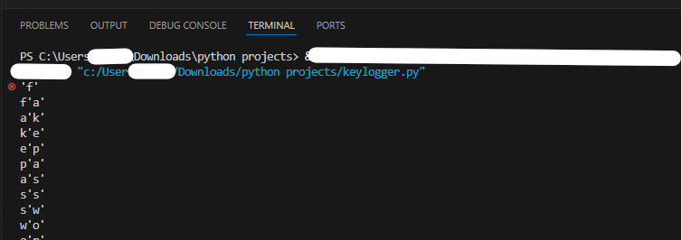
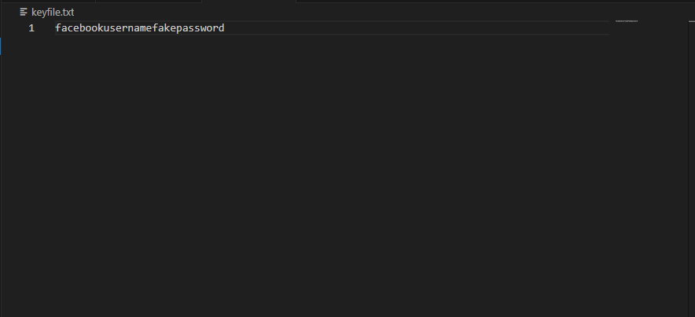
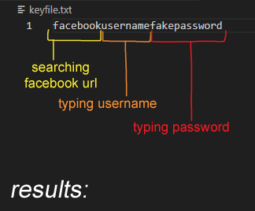

# simple-keylogger
Lightweight keylogger designed to record basic keyboard input, made with Python.
For educational purposes only.

When this keylogger is ran, it will most likely be flagged and quarantined by Microsoft Defender Antivirus.
## Prerequisites
- [Python](https://www.python.org/downloads/)

**Install the required libraries:**
```
# Install this in your terminal

python -m pip install pynput
```

## Purpose
I wanted to further understand how keyloggers work, and what a threat actor would see from a simple keylogger like this one. This project provides code for those interested in understanding some perspective of threat actors and what they might see when running keyloggers.

## Running the project
```
# Run the script in the folder's terminal

python3 keylogger.py
```
<br>

## How it works
#### 1. When you run the project, any keystroke you type while it runs will be recorded on the keyfile.txt file automatically created.

<p align="center">
  
</p>

<br>

#### 2. Here's what the threat actor sees.
The scenario is an unsuspecting person logging into their Facebook.
<br>
<p align="center">
  
</p>
<br>
 
## Extra
Here's what it really looks like on their end.

<p align="center">
  
</p>
